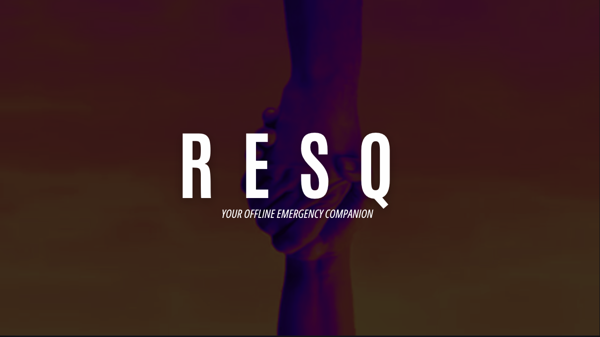
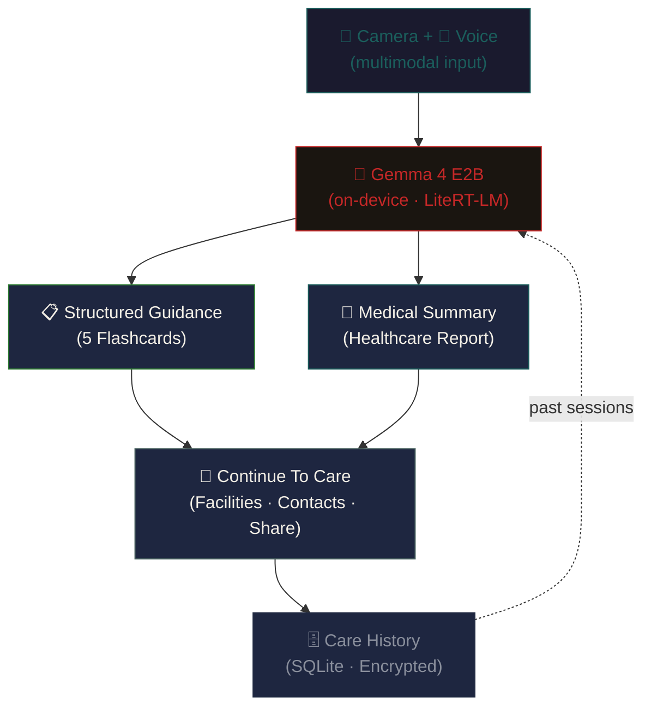

<p align="center">
  
</p>

<h1 align="center">ResQ</h1>

<p align="center">
  <strong>Offline emergency intelligence companion</strong>
</p>

<p align="center">
  
<a href="https://youtu.be/ZUY2emrWtsA" target="_blank">
  
</a>
  
  
  
  
  
</p>

---

ResQ is an **on-device emergency intelligence companion** built for the moments between an incident and professional medical care — when there is no internet, no doctor, and no one to tell you what to do. It uses **Gemma 4 E2B — running entirely on your device** — to analyse emergency situations through camera, voice, and text, then provides calm, structured guidance in five scannable cards.

**Zero network requests after model download.** A live privacy counter proves it.

---

## The Problem

It is 11:30 PM at FUTMinna. A student walks back from night class at Gidan Kwano campus. A snake bites his ankle. The university clinic is closed. The nearest hospital is 4 hours away. His phone has no signal.

In rural Nigeria, this is everyday reality. The minutes between an incident and professional care are when permanent harm happens — tourniquets on snake bites, butter on burns, moving fracture victims incorrectly.

Existing solutions need internet, which is the first thing to go. ChatGPT cannot help when there is no signal.

---

## Key Features

| Feature | Description |
|---|---|
| **Multimodal Emergency Analysis** | Camera captures injury photos; voice records your description. Gemma 4's vision encoder and language model analyse both together. |
| **Structured Guidance** | Five calm, scannable cards: Assessment, Actions, Avoid, Monitor, Seek Care. Never raw AI text. |
| **Medical Summaries** | Professional reports formatted for healthcare providers — timeline, symptoms, findings, actions taken. |
| **Complete Privacy** | All processing is on-device. A live network monitor proves zero outbound requests. Encrypted medical profiles. |
| **Offline Facilities** | Local JSON database of medical facilities sorted by GPS proximity. Works without internet. |
| **Care History** | Every emergency session saved locally with full timeline, images, and generated reports. |
| **Auto Model Download** | Gemma 4 E2B (~2.4GB) downloads on first launch with progress tracking and comforting messages. |

---

## Tech Stack

| Layer | Technology |
|---|---|
| **Framework** | Flutter 3.44+ (Android + iOS) |
| **On-Device Model** | Gemma 4 E2B via `flutter_gemma` 1.3.0 + `flutter_gemma_litertlm` (LiteRT-LM engine) |
| **State Management** | Riverpod |
| **Routing** | GoRouter |
| **Local Database** | SQLite (sqflite) |
| **Encryption** | flutter_secure_storage |
| **Typography** | Bundled Inter font. No runtime fetches. |
| **Icons** | HugeIcons |

---

## Architecture

> **The design point:** structured UI owns the experience; Gemma owns the understanding.



- **Deterministic code** owns: guidance card rendering, medical summary formatting, GPS proximity calculations, encrypted profile storage, local facilities database.
- **Gemma** does what only a model can: analyse images and voice together, determine emergency type and severity, generate structured JSON guidance, write professional medical summaries.

---

## Getting Started

### Prerequisites

- Flutter 3.44+
- Android device with 4GB+ RAM (for on-device inference)
- iOS 16.0+ device
- A free [Hugging Face read token](https://huggingface.co/settings/tokens)

### 1. Get the model

The app **downloads the model automatically** on first launch — no manual setup needed. It fetches Gemma 4 E2B (~2.4GB) from Hugging Face with a progress bar and comforting messages.

<details>
<summary>Manual setup (optional — for developers)</summary>

Download from [litert-community/gemma-4-E2B-it-litert-lm](https://huggingface.co/litert-community/gemma-4-E2B-it-litert-lm) (ungated, Apache 2.0):

```bash
# Android
adb push gemma-4-E2B-it.litertlm /sdcard/Android/data/com.resq.resq/files/

# iOS
# Use Finder/iTunes File Sharing to copy the model into the app's documents
```

</details>

### 2. Build & run

```bash
git clone https://github.com/THEJOHNCALEB/resq.git
cd resq

cp config.example.json config.json
# Edit config.json with your Hugging Face token

flutter pub get
flutter run --dart-define-from-file=config.json
```

### 3. Run tests

```bash
flutter test
```

> 6 tests verify the deterministic pipeline: emergency session serialization, medical profile encryption, JSON roundtrip integrity — no model required.

---

## Privacy Commitment

| | |
|---|---|
| **No data leaves the device** | Every image, voice recording, and medical profile is processed on-device. The privacy seal is a live network counter, not a badge. |
| **No runtime font fetches** | Inter is bundled as an asset — `google_fonts` was removed entirely to keep the "0 requests" seal literally true. |
| **No real data in the repo** | `.gitignore` blocks `*.task`, `*.bin`, `*.litertlm`, `*.m4a`, `config.json`. |
| **Auditable proof** | `HttpOverrides` + fetch patching intercept and count every outbound request across all platforms. |

---

## Releases

Pre-built APKs are available on the [**Releases**](https://github.com/THEJOHNCALEB/resq/releases) page.

The CI/CD pipeline (`.github/workflows/release.yml`) automatically builds release APKs on tagged pushes:

```bash
git tag v1.0.0
git push origin v1.0.0
```

---

## License

[Apache 2.0](LICENSE)

---

<p align="center">
  <sub>Built for Build with Gemma: AI for Africa — FUTMinna 2026</sub>
  <br/>
  <sub><em>Gemma is a trademark of Google LLC.</em></sub>
</p>
